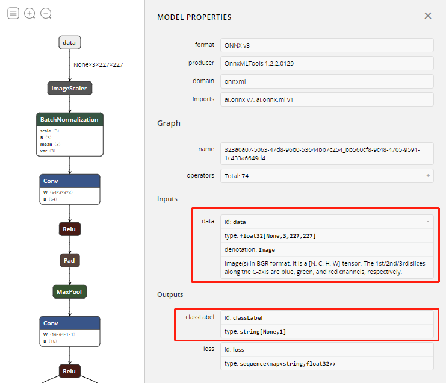

# 看图识熊
Copyright © Microsoft Corporation. All rights reserved.
  适用于[License](https://github.com/Microsoft/ai-edu/blob/master/LICENSE.md)版权许可
  
**主要知识点：**

  - 了解定制化视觉服务

  - 体验定制化视觉服务

  - 体验AI集成开发环境

  - 体验离线模型推理应用

# 目录

- [概述](#概述)
- [准备数据](#准备数据)
- [获取模型](#获取模型)
  - [定制化视觉服务简介](#定制化视觉服务简介)
  - [体验定制化视觉服务](#体验定制化视觉服务)
    - [登录定制化视觉服务](#登录定制化视觉服务)
    - [创建定制化视觉服务项目](#创建定制化视觉服务项目)
    - [添加数据](#添加数据)
    - [训练](#训练)
    - [测试](#测试)
    - [其它信息](#其它信息)
    - [导出模型](#导出模型)
- [构建应用](#构建应用)
  - [界面设计](#界面设计)
  - [查看模型信息](#查看模型信息)
  - [封装模型推理类库](#封装模型推理类库)
  - [使用模型推理类库](#使用模型推理类库)
  - [测试](#测试-1)
  - [更新模型](#更新模型)
- [小结](#小结)
- [代码](./微软-方案1/src)

# 概述

人工智能已经快要进入应用的高峰期了，但并不需要每个人都学习算法、建模。对于程序员来说，应该先从自己会的方向入手，学习如何应用AI来解决问题，开发应用。

本文将带着大家动手，从头做一个看图识熊的应用，输入一张熊的照片，程序输出这是什么熊。这里不会讲到AI的算法、模型，但会对涉及到的应用有关的概念做些介绍。

文中，我们将使用微软认知服务的必应图像搜索准备训练数据，然后用微软认知服务的定制化视觉服务训练模型，最后用Visual Studio Tools
for
AI将模型集成到应用中。

# 准备数据

机器学习总是离不开数据，没有数据就无法进行训练。

微软认知服务中除了提供了语音、视觉类的服务，还提供了搜索服务，其中就有必应图像搜索服务。

必应图像搜索的在线体验地址是<https://azure.microsoft.com/zh-cn/services/cognitive-services/bing-image-search-api/>。

输入要搜索图片的关键字，指定需要的图片的参数，右侧就可以预览搜索结果。还可以切换到JSON显示，可以看到返回值是结构化的数据，很容易得到每张图的链接地址。

如果需要大量的数据，可以申请一个密钥，写个简单程序调用必应图片搜索，然后下载图片即可。

本文计划让我们的程序可以识别出棕熊、黑熊、北极熊、熊猫这四种熊，所以需要分别搜索这四种熊的图片，每种熊需要的训练数据不多，5张图片就够了，大家可以手动下载图片。另外，为了防止随便给一张图片就被分类成某种熊，我们还需要一些负例，可以找5张其它动物的图片，作为负例。

这里需要注意一下，在选择训练数据的时候，要注意数据的泛化性。也就是说，选出来的图要尽可能的不一样。比如，不能只选草地上的，也不能只选走路的熊，还得选站着的熊。不然，可能模型会把草地认成熊。

最好是按照文件夹把熊都分好类，这样一会儿训练的时候就比较容易。这个用文件夹分类的过程，其实就是标记数据的过程。我们这次要解决的问题是分类问题，所以，标记起来是非常快的。有些应用标记起来就没那么容易了。比如图片中的目标检测，要对每个目标画一个框，而且要尽量画准。再比如音频的标记，要听录音，然后把文字打出来，甚至需要每个字都写上在什么时候开始、什么时候结束。所以，有了数据、再把人类知识应用到数据上，有时会是很大的工作量。

# 获取模型

在机器学习应用中，任何情况下都需要一个或大或小的模型。而怎么得到这个模型，往往是其中最复杂的部分。有的时候，在缺少强大计算资源与高性能算法的情况下，我们不一定需要自己从零开始训练模型。我们需要用的一些轮子，已经有人给我们造好了。比如微软提供的定制化视觉服务。

## 定制化视觉服务简介

定制化视觉服务，相当于在云端提供了一个生成模型的方法，把模型相关的复杂的算法都简化了。同时，它能够让用户自己管理训练数据，定义自己的分类问题。这样在易用、强大之间找到了一个平衡点。

从适用的范围上讲，如果要分类的项在图像中比较突出，则定制化视觉服务可发挥比较好的效果。但是，定制化视觉服务并不适合用于检测细微的差异。例如，检测质量发现产品中的细微裂纹或凹陷。另外，因为这个世界纷繁复杂，能进入人眼的物体和它们的排布、表现方式的组合，几乎是无穷无尽的。定制化视觉服务后面的模型也不能解决所有领域的问题，这样会影响精确性。所以定制化视觉服务既提供了通用模型，又提供了几个特定的领域模型。如果对识别性能要求很高，则需要定制化视觉服务后面的领域模型非常强大才行。

从训练速度上讲，传统的训练模型需要数小时的时间，而定制化视觉服务采用了迁移学习的方法，这种方法可以在已有的预训练模型的基础上，只有需要少量的训练图片和很短的训练时间，就可以训练出针对特定问题的新的模型。有点类似四五岁的小孩子学习新的动物，已经用了四五年的时间对动物的各种特征有了初步了解，也会基本的认知分类，然后再给他一种新的动物的几张图片，他瞬间就能学会如何成功的区分新的动物。

## 体验定制化视觉服务

下面我们一起动手在线体验一下定制化视觉服务，试着训练模型并导出。

### 登录定制化视觉服务

定制化视觉服务的官方地址是<https://customvision.ai/>，打开网站后，点击SIGN
IN。使用该服务需要准备微软账号，也可以直接在定制化视觉服务官方地址上创建。

登录后，界面会提示要求同意一些条约。条约的大致内容就是，个人必须在微软要求的规则下使用微软提供的这项服务。请勾选I
agree

此时，界面会提示注册Azure，因为定制化视觉服务实际上是Azure提供的一项云服务，正式使用这项服务需要有Azure订阅。

不过我们现在只是免费试用，所以选择Continue with
trial，如果在根据本文流程做完了一个小应用之后，你觉得确实需要使用这项服务，那么你可以去注册Azure账号，获取Azure订阅。

### 创建定制化视觉服务项目

点击NEW
PROJECT，填写项目信息。填写好Name和Description，这里Name不妨填写为BearClassification。随后选择Classification和General(compact)，点击Create。

Project Type一栏，定制化视觉服务提供了分类和目标检测两种服务，这里选择分类项目。

Classification
Types一栏，这里使用的图片中，每张图片只有一种熊，这里选择每张图片一个标签的模式。

Domains一栏，可以看到服务提供了多种预定义的场景，可以对特定领域的分类给出更好的结果。但是这里没有专门针对动物的，所以使用通用领域。另外还可以看到有的领域区分带compact标记和不带标记的，本文使用带标记的，即General(compact)领域。

带有compact标记，表明训练后的结果是一个压缩模型。压缩模型，顾名思义，模型占用的空间更少，运行更快，甚至可以放到手机这种移动设备里。当然，会有一个小问题就是精确度会受影响。但是压缩模型也有好处，导出模型后，模型文件的使用是没有任何限制的，而其余的几种场景只能通过调用API来进行预测，当前属于免费试用，有10000次调用上限。

### 添加数据

点击Add images，选择前面事先准备好的5张黑熊的照片，然后在弹出的Image upload页面中，设置My Tags的值为black
bear，然后点击Upload 5 files。

注意，My Tags值不能使用中文，否则后续识别的结果会乱码。

重复以上步骤，依次添加灰熊、北极熊和大熊猫的训练数据，对应的标签是brown bear、polar bear和giant panda。

最后，上传不是熊的图片做为负例，对应的标签可以直接选择Negative。

### 训练

在添加了所有的数据集和标签之后，点击网页上方的Train，开始训练模型。

大约十秒钟以后，训练就完成了，页面会自动跳转到Performance页面，并显示本次训练的结果。如图所示，这里只训练了一次，左侧只有一个Iteration1，如果有多次训练就会出现多个Iteration，右侧是本次训练得到的模型的一些指标。

Precision准确率和Recall召回率，是两个评估模型好坏的主要指标。简单来说，两个数都是越大越好。但是这两个数据其实很难两全，提高其中一个，必然会降低另一个。

举个例子，欧美的法律很讲证据，是无罪推定。即，不能证明某人有罪，那就判他无罪。所以，被判刑的人，都是证据确凿的。这时，我们说罪犯中实际犯罪的人的比例非常高，但是很多罪犯可能并没被抓起来，所以召回率很低。而电视里看到的特务经常会说，宁可错杀一千，不可放过一个。这是有罪推定。只要有疑点，就抓起来。我们假设这里说的都是真正的罪犯。这时，我们说，罪犯中实际犯罪的人比例可能不高，有不少都是被冤枉的，所以准确率很低。但可以认为罪犯基本上都被抓住了，所以召回率比较高。

在这个项目中，以brown
bear为例：Precision准确率，表示在所有被识别为棕熊的图片中真正有棕熊的图片所占的比例；而Recall召回率则是测试结果中正确识别为棕熊的图片占测试集中所有棕熊图片的比例。

### 测试

定制化视觉服务支持快速的在线测试，点击页面顶部的Predictions进入预测页面，然后点击Quick
Test，打开测试页面。输入一张网络图片的地址或上传一张本地图片就可以看到预测结果。

这里，我们上传一张棕熊的图片([图片来源](https://pixabay.com/en/bear-bavarian-bear-wild-brown-bear-1545031/))，可以看到这个棕熊能够被正确的识别出来。

### 其它信息

点击界面右上角的齿轮，可以看到免费用户每个项目能够使用的服务额度：

一共可以上传5000张图片，创建50个不同标签，保存10次迭代的结果。

这十次迭代有什么用呢？当需要增删标签、给标签添加或删除训练图片时，这次再训练，就会花费掉一次迭代。

这些都是当前项目的总数而不是累计值。对于一般的免费用户，这基本上就相当于你可以随意使用这项服务了，如果有大量的训练数据，那么建议您还是订阅Azure云服务，Azure秉持着使用多少收费多少的原则，即使收费，也仍然良心。

### 导出模型

为了构建本地离线推理应用，我们需要下载模型。点击顶部Performance按钮回到训练结果页面并切换到要使用的Iteration，然后点击Export按钮，可以看到如下所示的导出页面。

定制化视觉服务一共提供了四种模型的导出，对三大操作系统都能支持，这里我们选择ONNX。

ONNX，全称Open Neural Network
Exchange，即开放神经网络交换格式，是由微软、FaceBook等多个相关公司一起推动的深度学习模型标准。Microsoft
Cognitive Toolkit、Caffe2、PyTorch等工具已经支持ONNX。

选择ONNX后，在Choose a version下拉框中选择ONNX1.2，点击Export，等待服务器把模型导出后，然后点击Download，即可下载模型，这里将名字改为BearModel.onnx。

注意，存放模型文件的路径不要包含中文。

### 查看模型

[Netron](https://github.com/lutzroeder/netron)是一个开源的模型信息的查看器，支持多种模型格式，可以[下载](https://github.com/lutzroeder/netron/releases)安装使用，也可以[在线查看](https://lutzroeder.github.io/netron/)模型信息。

Netron打开后，点击Open
model选择打开之前下载的BearModel.onnx文件。然后点击左上角的汉堡菜单显示模型的输入输出。

上图中可以看到该模型需要的输入data是一个float数组，数组中要求依次放置227\*227图片的所有蓝色分量、绿色分量和红色分量，后面程序中调用时要对输入图片做相应的处理。

上图中还可以看到输出有两个值，第一个值classLabel是确定的分类的标签，这里只需用到第二个输出即可，第二个值loss包含所有分类的得分。

# 构建应用

模型有了之后，这里就可着手构建应用程序来使用模型了。

这里以Windows平台为例，应用程序使用C#语言。我们有三种方案：

1. 使用[Windows Machine Learning](https://docs.microsoft.com/zh-cn/windows/ai/)加载模型并推理，这种方式要求系统必须是Windows 10，版本号大于17763，详细步骤在[这个文档](./OnnxWithWinML.md)

0. 使用由微软开源的[OnnxRuntime](https://github.com/Microsoft/onnxruntime)库加载模型并推理，系统可以是Windows 7 或 Windows 10，但目前仅支持x64平台，详细步骤在[这个文档](./OnnxWithOnnxRuntime.md)

0. 使用Tools for AI对模型进行封装，可以运行在Windows 7 或 Windows 10，但目前仅支持x64平台，详细步骤在[这个文档](OnnxWithToolsForAI.md)

# 小结

我们回顾一下本案例体验了哪些过程。首先，我们收集了一些数据，并给它们进行了分类。然后，使用定制化视觉服务训练并导出了模型。再然后就是代码部分，设计了界面、让它与代码能够联动。再然后就是代码中比较复杂的部分，即数据的规范化。最后的推理预测其实只有一行代码就够了。完成后，我们又添加新数据重新训练了一遍。

这个案例很简单，主要是希望大家体验一下AI应用开发。其实AI应用开发和我们传统的应用开发没有太大区别，可以认为就是调用了一个神奇的函数，给它一些数据，它就还给你一个答案。如果多有几个神奇的函数，那么就能做出更加智能的程序，就成为了真正的产品了。

最后，给大家留个小作业：大家可以用卡通熊或者毛绒熊玩具的照片测试一下，然后考虑如何能把这几种熊从真实熊的照片中区分出来。完成后可以找出一些新的卡通熊或毛绒熊图片进行测试，看看能否达到较好的分类效果。
